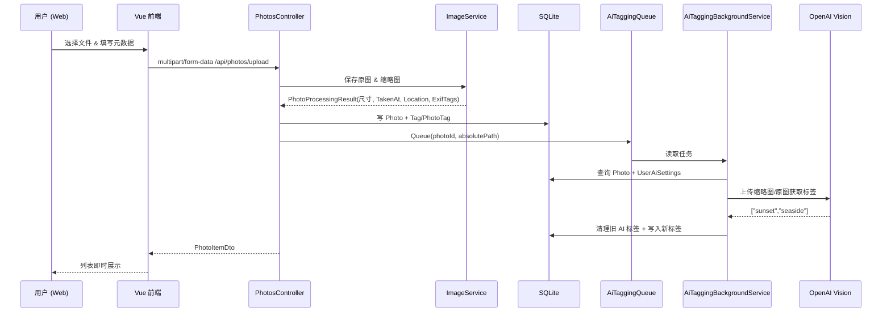

# 设计文档

本文档基于当前代码仓库（前端：`/frontend`，后端：`/backend`）的实际实现撰写，描述系统的目标、架构、核心模块、接口契约与关键流程，便于后续迭代与协作。

---

## 1. 项目概述

Photo Manager 是一套跨平台的照片资产管理系统，支持：

- 账号注册、登录、会话维持（基于服务端 Session）。
- 多图上传、EXIF 解析、缩略图生成与基础信息维护。
- 手动标签、EXIF 标签、AI 自动标签（OpenAI Vision）共存。
- 自然语言检索（MCP 兼容接口）与常规条件筛选（关键词、标签、日期、排序）。
- Web 端交互（单页面 Vue 3 + Vuetify 应用），包含批量删除、在线裁剪/滤镜编辑、AI 配置管理等功能。

---

## 2. 技术架构与选型

### 2.1 后端（`backend/`）

| 领域 | 选型与实现 |
| --- | --- |
| 运行时 | ASP.NET Core 9.0 (`Program.cs`) |
| 数据存储 | SQLite，EF Core 9 (`AppDbContext`) |
| 会话 | ASP.NET Session + 分布式内存缓存 |
| 安全 | BCrypt.Net 哈希 (`AuthController`)，CORS 白名单 (`appsettings.Development.json`) |
| 图像处理 | SixLabors.ImageSharp（缩略图、裁剪）、MetadataExtractor（EXIF） |
| AI 标签 | `OpenAI` SDK + `AiTaggingBackgroundService` 背景任务，使用 `System.Threading.Channels` 做队列 |
| API 文档 | NSwag (`AddOpenApiDocument`) |
| MCP | `McpController` + `McpSearchService` + `PhotoInsightTools`（`ModelContextProtocol.AspNetCore` SSE Server） |

### 2.2 前端（`frontend/`）

| 领域 | 选型与实现 |
| --- | --- |
| 框架 | Vue 3 + TypeScript (`main.ts`) |
| 状态管理 | Pinia：`stores/user`, `stores/photos`, `stores/aiSettings`, `stores/ui` |
| UI | Vuetify 3，自定义 Light/Dark 主题（`plugins/vuetify.ts`, `style.css`） |
| 网络 | Axios withCredentials（`services/http.ts`），统一请求基址、静态资源域名 |
| 组件 | 语义化拆分（`components/layout`, `components/photos`, `components/upload`, `components/ai`, `components/auth`） |
| 媒体处理 | Cropper.js + Canvas 二次渲染（`PhotoEditor.vue`） |

### 2.3 部署

- Docker Compose (`docker-compose.yml`) 编排前后端；前端通过 Nginx 暴露 8080 端口，后端监听 5000。
- `backend/app.db` 与 `backend/wwwroot/uploads` 通过宿主机绑定卷持久化数据库与上传文件。

---

## 3. 核心模块设计

### 3.1 身份认证（`backend/Controllers/AuthController.cs` + `frontend/src/components/auth/LoginPanel.vue`）

- **注册**（`POST /api/auth/register`）：校验用户名/邮箱唯一，BCrypt 哈希密码。
- **登录**（`POST /api/auth/login`）：支持“用户名或邮箱 + 密码”，成功后写 Session (`UserId`, `Username`)。
- **会话检查**（`GET /api/auth/me`）与**登出**（`POST /api/auth/logout`）用于前端刷新态。
- 前端 `LoginPanel` 以 Tab 切换登录/注册，复用 `useUserStore`，登录成功后触发 `photoStore.fetchPhotos()`。

### 3.2 图片资产（`PhotosController`, `ImageService`, `frontend/stores/photos.ts`）

1. 上传接口 `POST /api/photos/upload`
   - 限制 50MB (`[RequestSizeLimit]`)。
   - `ImageService.SavePhotoAsync`：
     - 将原图写入 `wwwroot/uploads/original`，命名 `${UTC时间}_${GUID}.ext`。
     - 使用 ImageSharp 生成 512x512（最长边）缩略图到 `uploads/thumbs`。
     - 读取 EXIF：拍摄时间 → `TakenAt` + “年份/年月”标签，GPS → `location` 标签，机型 → 标签。
   - `PhotosController` 把请求体 `Tags` 解析为手动标签（`TagType.Manual`），EXIF 标签分别入库，若有地点也生成 EXIF 标签。
   - 保存照片后异步入队 AI 标签任务。

2. 列表/详情
   - `POST /api/photos/list`：分页（pageSize ≤60）、关键词模糊（`EF.Functions.Like`）、标签、时间范围、排序（`createdAsc/Desc`、`takenAsc/Desc`）。
   - `POST /api/photos/detail`：携带 `Id`，返回单条详情。
   - 前端 `usePhotoStore` 负责构造 payload（含 query/tag/dateRange/sort），并将服务器返回的相对路径拼成绝对 URL（`toAbsolute` 使用 `API_ASSET_BASE`）。
   - `App.vue` 对 `selectedTags`、日期区间、分页进行 `watch`，自动重新拉取数据。

3. 编辑/删除
   - `POST /api/photos/edit`：接收新的文件，可选择 `SaveAsNew` 另存，或覆盖原文件（覆盖时会删除旧的磁盘文件并重建 EXIF 标签；可更新描述/地点/手动标签）。
   - `POST /api/photos/update-metadata`：仅更新描述与手动标签，保持 EXIF/AI 标签不动。
   - `POST /api/photos/delete`：删除数据库记录、`PhotoTags` 关联以及两份物理文件。
   - 前端组件：
     - `PhotoViewer`：大图灯箱，曝光“编辑/编辑标签/删除”操作，支持左右翻页。
     - `PhotoEditor`：基于 Cropper.js，支持裁剪比例、旋转、亮度/对比度/饱和度/灰度，并可“另存为”新图。
     - `PhotoMetadataDialog`：对描述/标签的表单式维护。
     - `PhotoDeleteDialog`：确认删除，成功后刷新 store。

4. 批量操作与 UI
   - `PhotoGallery` 支持排序与批量删除模式；批量删除会逐张调用 `deletePhoto`。
   - `UploadFab` 浮动按钮（需登录），支持多文件上传、一次性录入描述/标签/时间/地点，上传成功自动刷新列表并提示 Snackbar。

### 3.3 标签体系

| 类型 | 触发方式 | 数据来源 |
| --- | --- | --- |
| 手动标签 (`TagType.Manual`) | 用户上传/编辑时输入的文本；或在 `PhotoMetadataDialog` 中增删 | `PhotosController.AttachTagAsync` |
| EXIF 标签 (`TagType.Exif`) | Auto：拍摄年份、年月、GPS（格式如 `24.32N,118.10E`）、相机型号 | `ImageService` 调用 MetadataExtractor |
| AI 标签 (`TagType.Ai`) | AI 队列生成 | `AiTaggingBackgroundService` + `OpenAiVisionTagGenerator` |

- `Tag` 表使用 `(Name, Type)` 唯一索引，`PhotoTag` 维护多对多。
- AI 标签会在重新生成时清空旧的 AI 标签，确保数据与当前图像一致。

### 3.4 AI 配置与后台任务

1. 用户配置 (`AiSettingsController`)
   - `GET /api/ai-settings`：返回当前用户的模型、可选 Endpoint、是否已保存 API Key。
   - `POST /api/ai-settings`：允许更新模型/Endpoint；API Key 仅在用户显式勾选“更新”或首次配置时必填。
   - 数据持久化到 `UserAiSettings`（`UserId` UNIQUE），字段包括 `Provider`（默认 OpenAI）、`Model`、`Endpoint`、`ApiKey`、`UpdatedAt`。

2. 标签生成队列 (`AiTaggingBackgroundService`)
   - `IAiTaggingQueue.QueueAsync` 在上传/编辑后被调用，将 {photoId, absoluteFilePath} 丢入无界 Channel。
   - Hosted Service 单线程消费：拉取用户 AI 配置 → 调用 `IAiVisionTagGenerator.GenerateTagsAsync`（OpenAI Vision Chat API），System Prompt 限制输出 1~3 个中文标签。
   - 解析 JSON 数组或回退到分隔符解析，统一转成小写、短横线连接的标签。
   - 成功后追加到 `Tag (Type=Ai)`，缺失则自动插入，保存数据库。

### 3.5 MCP 检索（`McpSearchService` + `McpController` + `PhotoInsightTools`）

- `McpSearchService` 封装全部自然语言检索逻辑（SQL `LIKE` 初筛 + 应用层评分 + 结果格式化）。
- `PhotoInsightTools` 通过 `AddMcpServer().WithHttpTransport().WithTools<PhotoInsightTools>()` 注册为 SSE MCP Server 工具，自动映射 `/mcp/sse`、`/mcp/messages`。
- 工具列表：
  - `search_gallery_photos`：入参为`McpSearchRequest`，返回 `McpSearchResponse`。
  - `get_photo_details`：根据 `photoId` 返回尺寸、时间、地点、标签等结构化信息。
- 所有入口都会校验 Session 中的用户 ID，确保只能访问自己的照片。

### 3.6 前端交互层

- `AppHeader`：包含全局搜索框（500ms 防抖）、主题切换（读取/写入 `localStorage`，响应系统色彩偏好）、用户菜单（打开 AI 设置 / 退出登录 / 调上传弹窗）。
- `useUiStore`：追踪主题并在 `document.documentElement.dataset.theme` 上设置 `Light/Dark`，从而驱动 CSS 变量（`style.css`）。
- `usePhotoStore` 负责所有照片 CRUD、过滤条件、选择状态；`useUserStore` 维护登录态；`useAiSettingsStore` 拉取/保存 AI 配置；`useUiStore` 处理主题监听器。
- 组件树集中在 `App.vue`，未使用 Vue Router，所有视图靠条件渲染与对话框切换。

---

## 4. API 契约（摘要）

| 方法 | 路径 | 描述 | 请求体/参数 | 响应 |
| --- | --- | --- | --- | --- |
| POST | `/api/auth/register` | 注册 | `{ username, email, password }` | `{ message }` |
| POST | `/api/auth/login` | 登录 | `{ username, password }` | `UserResponse` |
| POST | `/api/auth/logout` | 注销 | – | `{ message }` |
| GET | `/api/auth/me` | 获取当前用户 | Cookie Session | `UserResponse` |
| POST | `/api/photos/upload` | 上传图片 | `FormData(File, Description?, Tags?, TakenAt?, Location?)` | `PhotoItemDto` |
| POST | `/api/photos/list` | 列表 | `{ page, pageSize, keyword?, tag?, from?, to?, sort? }` | `{ total, items[] }` |
| POST | `/api/photos/detail` | 单图详情 | `{ id }` | `PhotoItemDto` |
| POST | `/api/photos/edit` | 替换或另存图片 | `FormData(PhotoId, File, Description?, Tags?, TakenAt?, Location?, SaveAsNew?)` | `PhotoItemDto` |
| POST | `/api/photos/update-metadata` | 更新描述/手动标签 | `{ photoId, description?, tags[] }` | `PhotoItemDto` |
| POST | `/api/photos/delete` | 删除图片 | `{ photoId }` | `{ success: true }` |
| GET | `/api/ai-settings` | 读取 AI 配置 | – | `AiSettingsResponse` |
| POST | `/api/ai-settings` | 更新 AI 配置 | `{ model, endpoint?, apiKey?, updateApiKey }` | `AiSettingsResponse` |

所有接口均要求用户先登录（`AuthController` 除外），Session Cookie 需随请求带上。上传/编辑接口返回最新的 `PhotoItemDto`，方便前端立即刷新。

---

## 5. 数据库设计

| 表 | 字段 | 说明 |
| --- | --- | --- |
| `Users` | `Id`, `Username`(unique), `Email`(unique), `PasswordHash`, `CreatedAt`, `AiSetting` (导航) | 注册用户 |
| `Photos` | `Id`, `UserId`, `FilePath`, `ThumbnailPath`, `Width`, `Height`, `TakenAt`, `Location`, `Description`, `CreatedAt` | 一张图片的主记录 |
| `Tags` | `Id`, `Name`, `Type` (`0=Manual,1=Ai,2=Exif`) | 标签字典，`(Name, Type)` 唯一 |
| `PhotoTags` | `PhotoId`, `TagId`（联合主键） | 多对多关联 |
| `UserAiSettings` | `Id`, `UserId`(unique), `Provider`, `Model`, `Endpoint`, `ApiKey`, `UpdatedAt` | 每个用户一份 AI 配置 |

`Program.InitializeDatabase` 在启动时通过原生 SQL `CREATE TABLE IF NOT EXISTS` 确保表结构存在（适配 SQLite 在生产环境无迁移工具的情况），同时 EF Core 也定义了相同模型与索引，方便未来迁移。

---

## 6. 关键流程

### 6.1 上传与 AI 标签



### 6.2 图片编辑

1. 用户在 `PhotoViewer` 中点击“编辑” → 打开 `PhotoEditor`。
2. `PhotoEditor` 加载原图，使用 Cropper.js 允许裁剪/旋转；所有滤镜在 Canvas 上应用 CSS filter，再导出 JPEG Blob。
3. 生成的 Blob + `PhotoId` 封装为 `FormData`，调用 `POST /api/photos/edit`。
4. 服务器保存新文件、重建 EXIF 标签、可选另存为新记录，并重新入队 AI 标签。
5. 前端根据响应更新 `photoStore.items` 与 `activePhotoId`。

### 6.3 MCP 检索

1. 客户端通过 `GET /mcp/sse` + `POST /mcp/messages` 建立 SSE 会话（VS Code、Claude Desktop 等 MCP 客户端）。
2. `PhotoInsightTools` 通过 Session 解析当前用户 ID，然后调用 `IMcpSearchService.SearchAsync`。
3. `McpSearchService`：
   - 使用 SQL `LIKE` 对描述、地点、文件名、标签做初筛，并根据 `limit`、`from`、`to` 过滤。
   - 取 `limit*4` 的候选集，通过 TF-like 计分/降序排序。
   - 构建 `McpSearchResult`：两段文本（摘要 + 属性列表）以及 `photoId/fileUrl/thumbnailUrl/tags/takenAt/location/width/height/createdAt` 等 metadata。
4. SSE 工具返回值直接按照 MCP 协议写回 `POST /mcp/messages` 响应

---

## 7. 项目结构

### 7.1 后端

```text
/backend
  Controllers/
    AuthController.cs
    PhotosController.cs
    McpController.cs
    AiSettingsController.cs
  DTOs/ (AuthDtos.cs, PhotoDtos.cs, McpDtos.cs, AiSettingsDtos.cs)
  Model/ (User, Photo, Tag, PhotoTag, UserAiSetting)
  Services/
    ImageService.cs           # 保存图片、生成缩略图、解析 EXIF
    OpenAiVisionTagGenerator.cs
    AiTaggingBackgroundService.cs
    McpSearchService.cs       # 提供 MCP 检索核心逻辑，供 REST + MCP 工具复用
  Mcp/
    PhotoInsightTools.cs      # 面向 Model Context Protocol 的工具集合
  Data/AppDbContext.cs
  Program.cs
  wwwroot/uploads             # 静态文件根目录
```

### 7.2 前端

```text
/frontend/src
  App.vue                     # 单页面入口，集中 orchestrator
  main.ts                     # createApp + Pinia + Vuetify
  stores/                     # user/photos/aiSettings/ui
  services/                   # auth/photos/ai/http（axios 实例）
  components/
    layout/AppHeader.vue
    auth/LoginPanel.vue
    photos/PhotoGallery.vue, PhotoCard.vue, PhotoViewer.vue,
           PhotoEditor.vue, PhotoMetadataDialog.vue, PhotoDeleteDialog.vue
    upload/UploadFab.vue
    ai/AiSettingsDialog.vue
  plugins/vuetify.ts          # 主题
  style.css                   # 全局 CSS 变量
  utils/errors.ts             # Axios 错误提取
```

---

## 8. Docker 与运行

1. **本地开发**：后端 `dotnet watch run`（默认 https://localhost:5001），前端 `pnpm run dev`（默认 http://localhost:5173）。需在 `backend/appsettings.Development.json` 中确保前端 Origin 白名单正确。
2. **容器**：`docker-compose up -d --build`。前端容器通过 `nginx.conf` 反代静态资源并将 `/api` 代理到后端容器。卷：
   - `./backend/app.db:/app/app.db`
   - `./backend/wwwroot/uploads:/app/wwwroot/uploads`
3. **配置密钥**：OpenAI API Key 由用户登录后在“AI 标签配置”对话框中填写，存储于 `UserAiSettings.ApiKey`。

---

## 9. 测试与质量保障

| 层级 | 涉及模块 | 建议 |
| --- | --- | --- |
| 单元测试 | `ImageService`、`AiTaggingBackgroundService`、`McpController` 的评分逻辑 | 使用 xUnit + EF Core InMemory/Sqlite in-memory；验证 EXIF 解析分支、AI 标签覆盖规则、MCP 分值排序 |
| 集成测试 | Auth/Photos/AiSettings API | 使用 `WebApplicationFactory` 或 Swagger/REST Client 脚本 (`backend/backend.http`) 自动化验证 |
| 前端交互 | `PhotoEditor`, `UploadFab`, 批量删除流程 | 可用 Vitest + Vue Test Utils 或 Cypress 做端到端冒烟 |
| 手工验收 | 大文件上传（>10MB）、AI 配置缺失/存在的两种分支、MCP 查询 | 确保用户体验覆盖关键路径 |

当前仓库尚未包含自动化测试目录，上述建议为后续扩展指引。

---

## 10. 后续迭代建议

1. MCP 检索可接入向量数据库或 OpenAI Embedding，以提升语义效果。
2. 前端可拆分为多路由页面（登录/库/设置）并增加离线提示。

以上内容与仓库现状一致，可作为开发、测试与部署的权威设计描述。
