# Photo Manager 功能测试报告

## 1. 测试范围

| 序号 | 功能 | 描述 |
| --- | --- | --- |
| 1 | 用户注册/登录 | 注册表单校验（长度、邮箱格式、唯一性）与登录后的会话维持 |
| 2 | 图片上传 | 通过 PC 与移动端浏览器上传多种图片格式 |
| 3 | EXIF 自动标签 | 解析时间、地点、分辨率等元数据并生成系统标签 |
| 4 | 自定义标签 | 手动添加/编辑标签并用于检索 |
| 5 | 缩略图生成 | 生成 512px 缩略图，确保列表加载性能 |
| 6 | 查询 | 关键词、标签、日期、排序等组合检索 |
| 7 | 展示界面 | 轮播/灯箱展示与批量操作体验 |
| 8 | 在线编辑 | 裁剪、旋转、滤镜等轻量编辑能力 |
| 9 | 删除功能 | 单张/批量删除并清理物理文件 |
| 10 | 移动端适配 | 手机浏览器与微信内置环境布局适配 |
| 11 | AI 标签 | 视觉模型生成多类型标签 |
| 12 | MCP 检索接口 | 通过 MCP 对话检索站内图片 |

---

## 2. 测试环境

| 组件 | 版本 / 设备 | 说明 |
| --- | --- | --- |
| 操作系统 | Windows 11 24H2 / Hyper OS 3 | PC + XiaoMi 13 |
| 浏览器 | Edge / 微信内置 | 含深色模式 |
| 后端 | .NET 9.0.0  | SQLite `app.db` 全新实例 |
| 前端 | Node 24.3.0 + pnpm 10.19.0 + Vite 4.4.9 | `pnpm run dev` |
| 测试工具 | Swagger, Cherry Studio | 用于 API 与数据库验证 |

---
## 3. 测试结果


### 3.1 用户注册与登录

登录<http://localhost:5173>:

首先注册用户：
```
username: test
email: test@mail.com
password: 123456
```

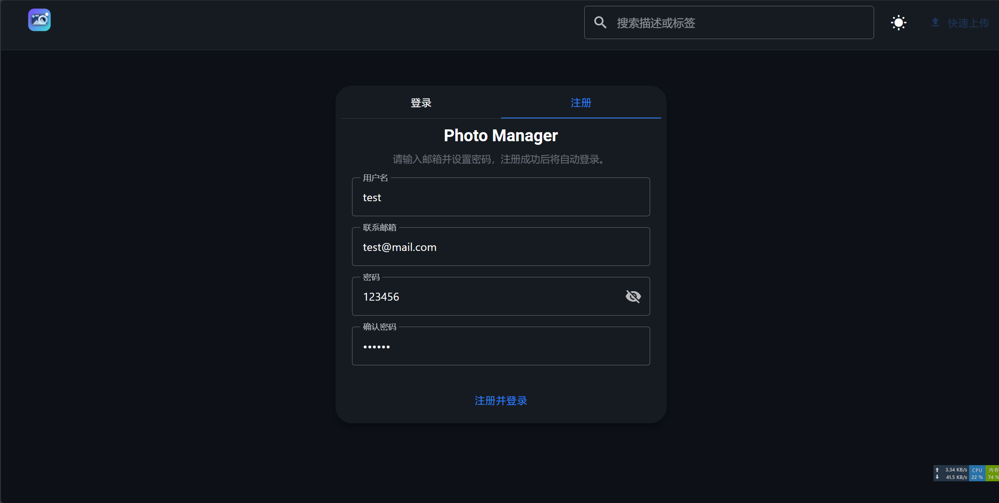

登录成功后照片库内容为空：

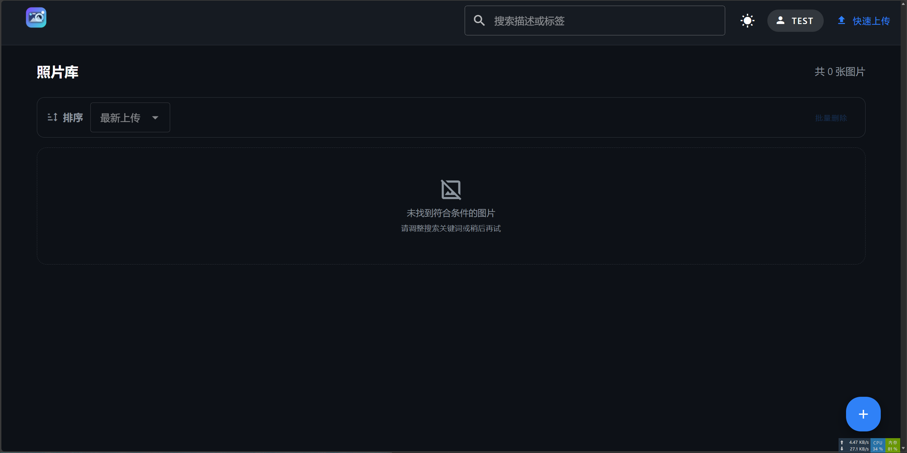

### 3.2 图片上传、存储与缩略图

首先上传带有 EXIF 信息的测试图片(来源: <https://github.com/ianare/exif-py/tree/master/tests/resources/jpg/gps>)

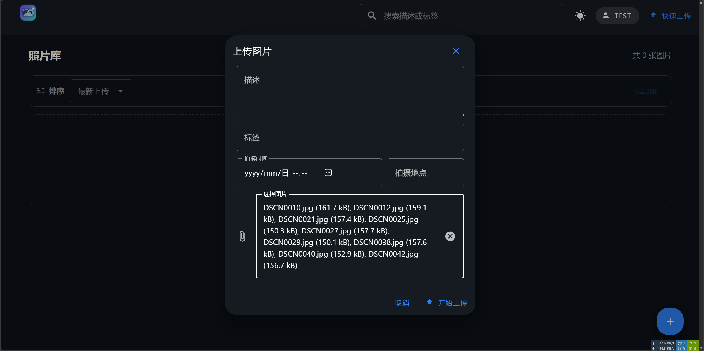

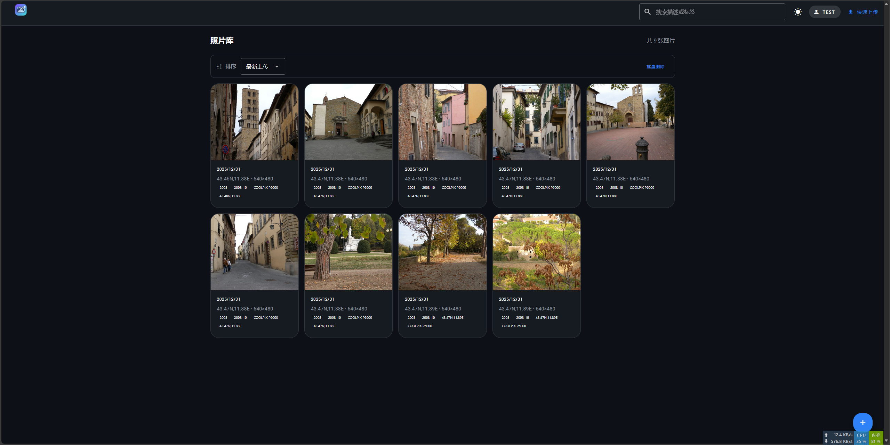

在后端`wwwroot/uploads`目录下可以看到图片与缩略图

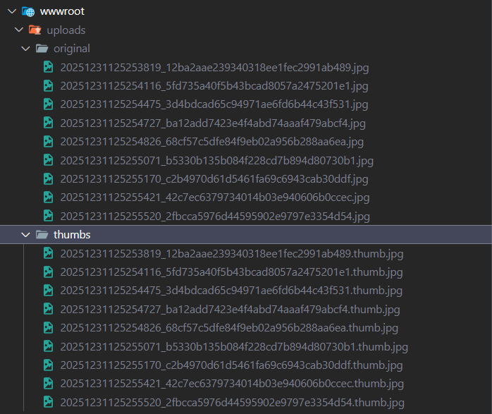

### 3.3 EXIF 自动标签与辅助信息

可以看到成功识别到了分辨率、拍摄设备、时间与地理位置：

> 640x480, COOLPIX P6000, 2008-10, 43.46N 11.88E

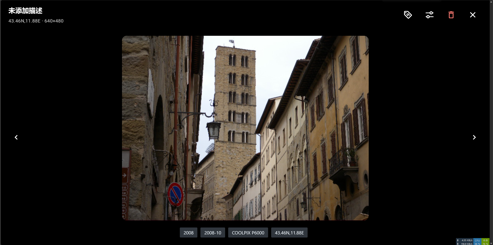


### 3.4 自定义标签与描述

为图片添加自定义标签：欧洲，描述：意大利小巷

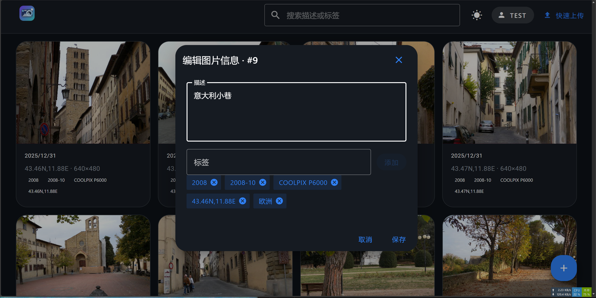

### 3.5 查询界面与展示交互

在顶部搜索栏搜索任一关键词，如“意大利”，即可搜索到想要的图片

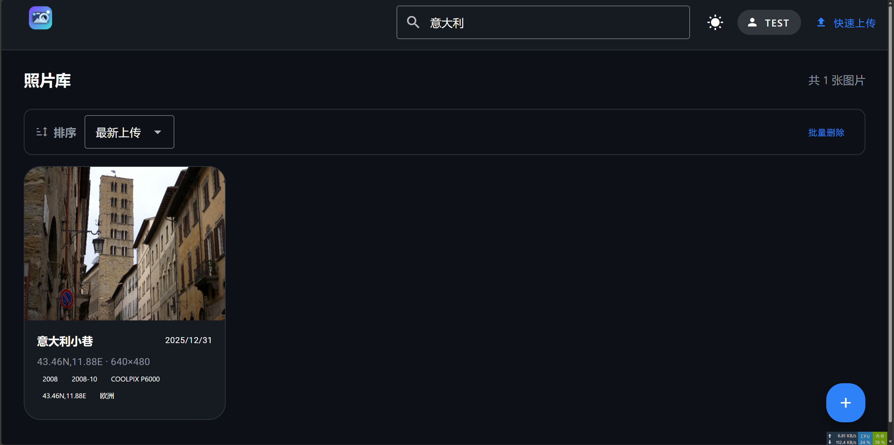

### 3.6 图片编辑功能

可以修改图片的尺寸、旋转方向、亮度、对比度、饱和度、灰度。修改完成后可以选择另存为新图片或覆盖保存

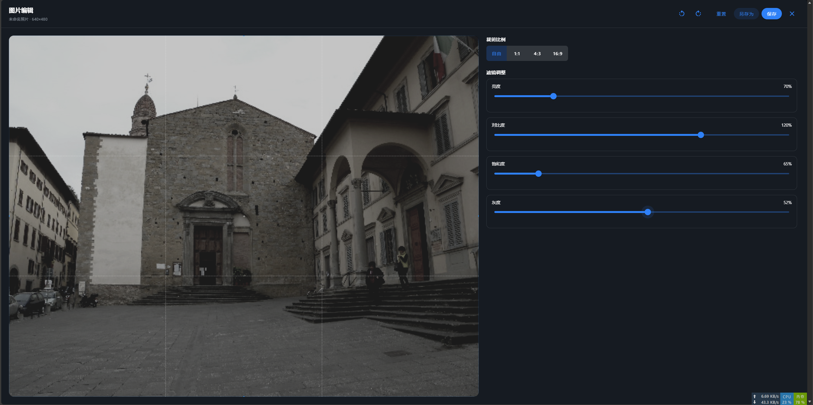

### 3.7 删除功能

可以单独删除一张图片，也可以选择批量删除

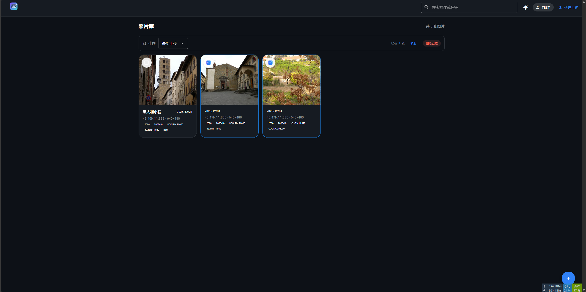

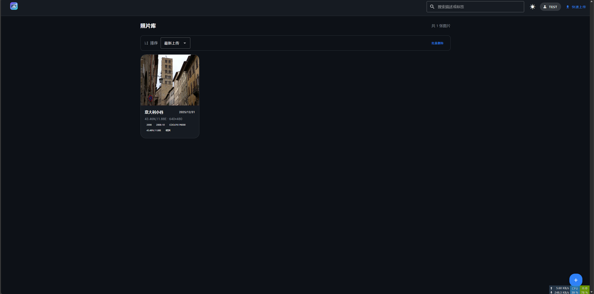

### 3.8 移动端适配

移动端在微信内置浏览器中打开<http://局域网IP:5173>：
功能齐全，布局适配良好

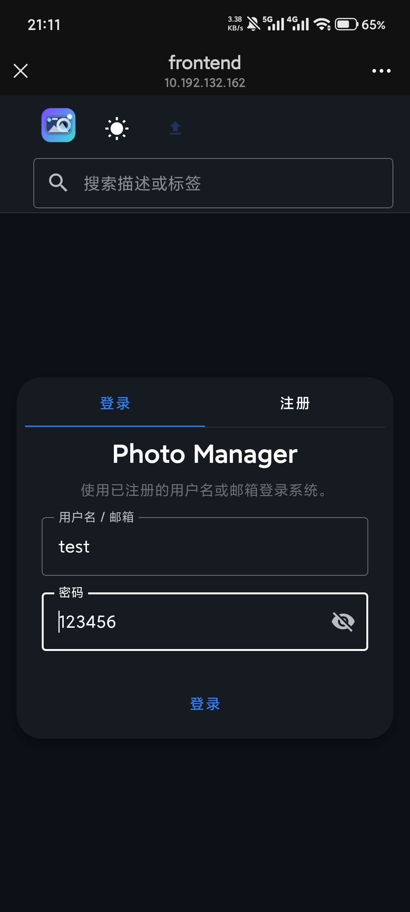 

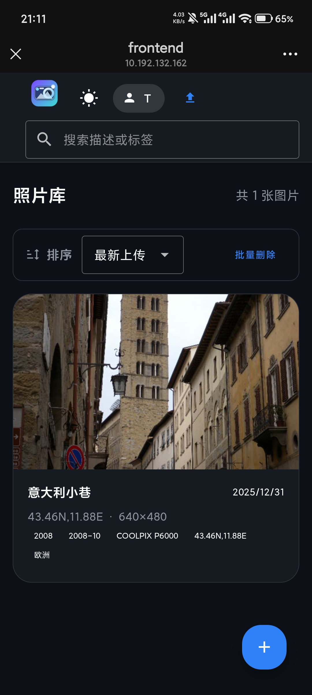 

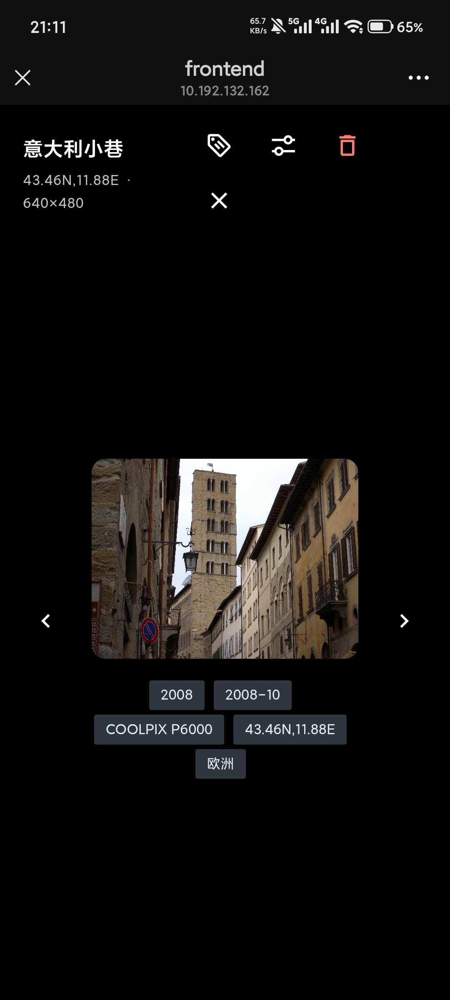 

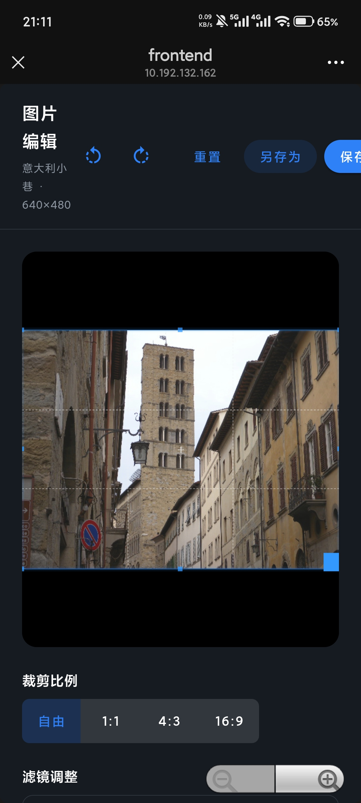

### 3.9 增强功能：AI 标签 

需要配置 API key 后上传图片，稍后手动刷新即可看到 AI 生成的标签。

> 测试使用的模型为 qwen3-vl-flash，相当便宜

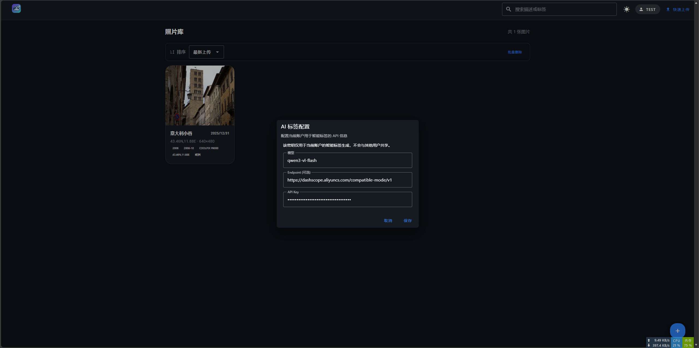

可以看到 AI 提取的标签为 “华丽装饰”，“人像”，“动漫风格”

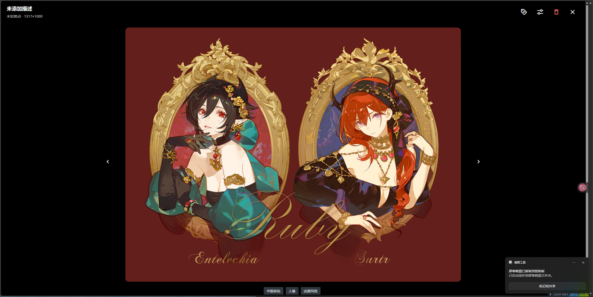

### 3.10 增强功能：MCP 检索

测试用的 MCP Client 为 Cherry Studio，配置好 MCP Server 地址与认证 Token 后启用。模型为deepseek-chat

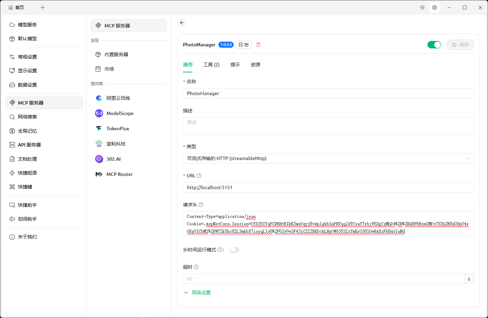

让模型找几张插画，经过提醒后成功找到了图片


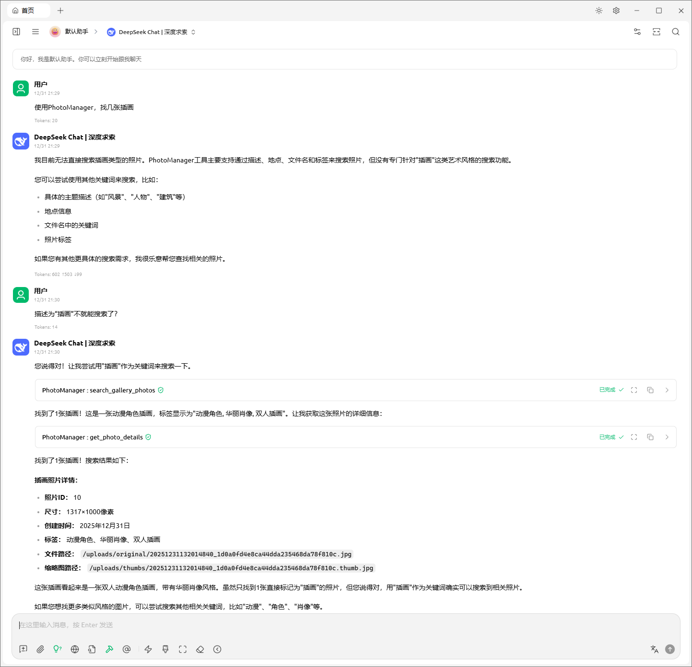